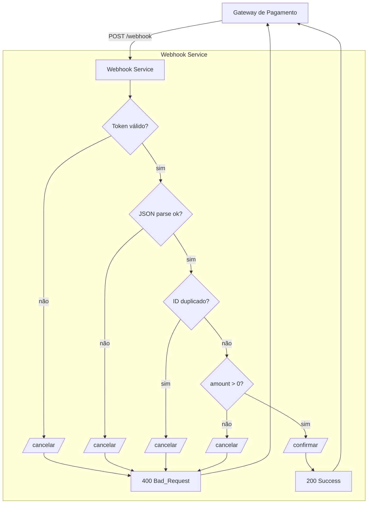

# Webhook Service OCaml

Um serviço de webhook HTTP em OCaml para processamento de transações de pagamento

##  Itens Opcionais (Esperado: Nota A)
- ✅ **Verificar integridade do payload**  
  - Parsing com `[@@deriving yojson]` e tratamento de erro JSON.
- ✅ **Mecanismo de veracidade da transação**  
  - Checagem de `X-Webhook-Token` contra segredo.
- ✅ **Cancelar em caso de divergência**  
  - Detecção de `transaction_id` duplicado ou `amount ≤ 0`.
- ✅ **Confirmar em caso de sucesso**  
  - Chamada a `/confirmar` somente quando todos os checks passam.

## Resultado do teste do python 
```bash
✅ Confirmação recebida: {'event': 'payment_success', 'transaction_id': 'abc123', 'amount': '49.90', 'currency': 'BRL', 'timestamp': '2023-10-01T12:00:00Z'}
1. Webhook test ok: successful!
❌ Cancelamento recebido: {'transaction_id': 'abc123'}
2. Webhook test ok: transação duplicada!
❌ Cancelamento recebido: {'transaction_id': 'abc123a'}
3. Webhook test ok: amount incorreto!
❌ Cancelamento recebido: {'transaction_id': 'abc123ab'}
4. Webhook test ok: Token Invalido!
5. Webhook test ok: Payload Invalido!
❌ Cancelamento recebido: {'transaction_id': 'abc123abc'}
6. Webhook test ok: Campos ausentes!
6/6 tests completed.
Confirmações recebidas: ['abc123']
Cancelamentos recebidos: ['abc123', 'abc123a', 'abc123ab', 'abc123abc']
```

## Como instalar/rodar


### Instalação das dependências OCaml:

```bash
# Instalar OCaml e Opam (Ubuntu/Debian)
sudo apt update
sudo apt install ocaml opam

# Inicializar Opam
opam init -y
eval $(opam env)
# Instalar Dune
opam install dune
# Instalar dependências do projeto
opam install dream yojson lwt cohttp-lwt-unix uri ppx_deriving_yojson lwt_ppx
```

##  Instalação

```bash
# Clonar o repositório
git clone https://github.com/Tanakavitor/webhookfunc.git
#Entrar no projeto
cd webhookfunc

# Compilar o projeto
cd webhook
dune build
```

##  Como Executar

### 1. Iniciar o Webhook Service

```bash
# Na pasta webhook/
dune exec webhook

```

O serviço ficará acessível em http://localhost:5000, ou em outro local conforme indicado no terminal.


### 2. Arquivo de teste em python
Para rodar o arquivo de teste em Python, certifique-se de que o serviço webhook já está em execução. Em seguida, abra outro terminal e execute os comandos abaixo

```bash
# Em outro terminal
cd python
python3 test_webhook.py
```

## Endpoints

### POST `/webhook`

Processa transações de pagamento via webhook.

**Headers:**
```
Content-Type: application/json
X-Webhook-Token: meu-token-secreto
```

**Body:**
```json
{
  "event": "payment_success",
  "transaction_id": "txn_123456",
  "amount": "99.99",
  "currency": "BRL",
  "timestamp": "2025-06-09T12:00:00Z"
}
```

**Respostas:**

| Status | Caso | Resposta |
|--------|------|----------|
| `200` | ✅ Transação válida | `"Success"` |
| `400` | ❌ Transação duplicada | `"Duplicate transaction"` |
| `400` | ❌ Amount inválido | `"Invalid amount"` |
| `400` | ❌ JSON inválido | `"Invalid JSON: <error>"` |
| `400` | ❌ Token inválido | `"Invalid or missing token"` |


## 🏗️ Fluxo do Webhook



